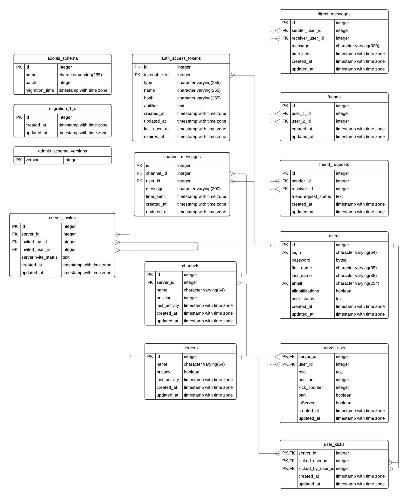
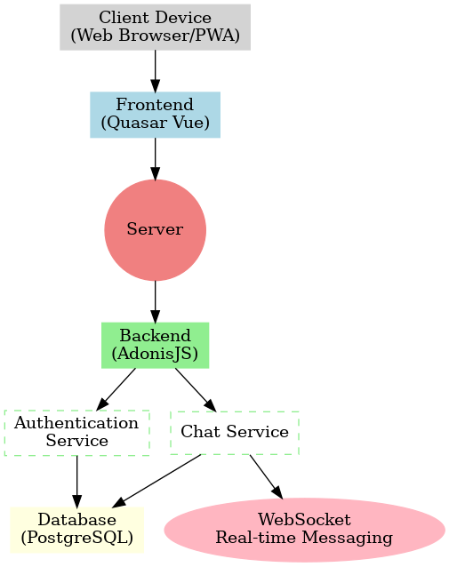
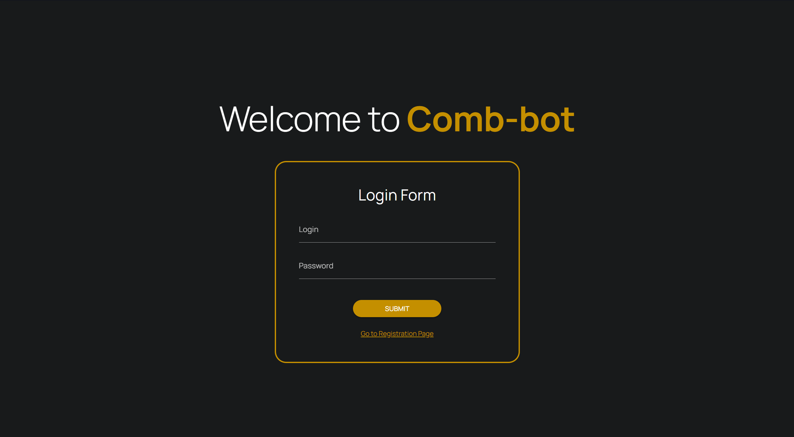
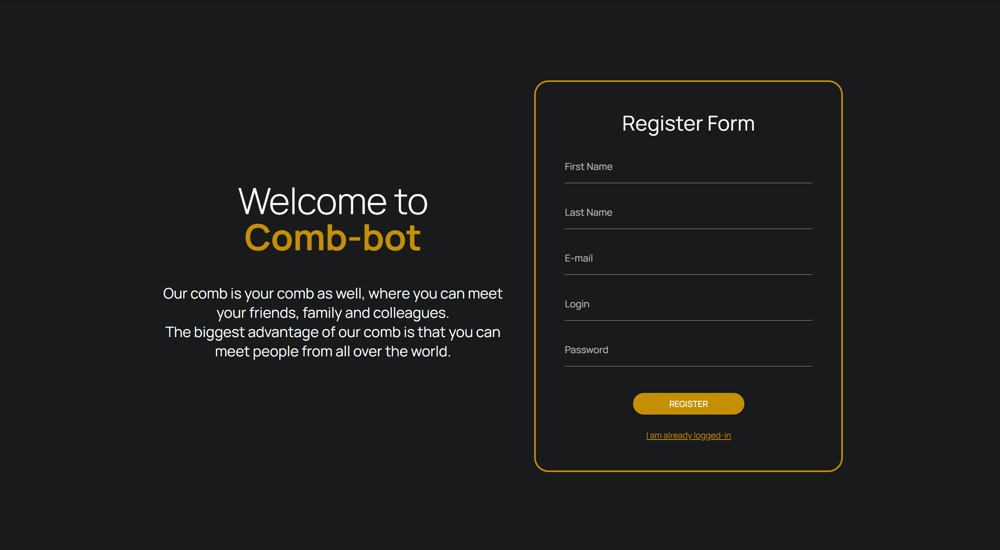
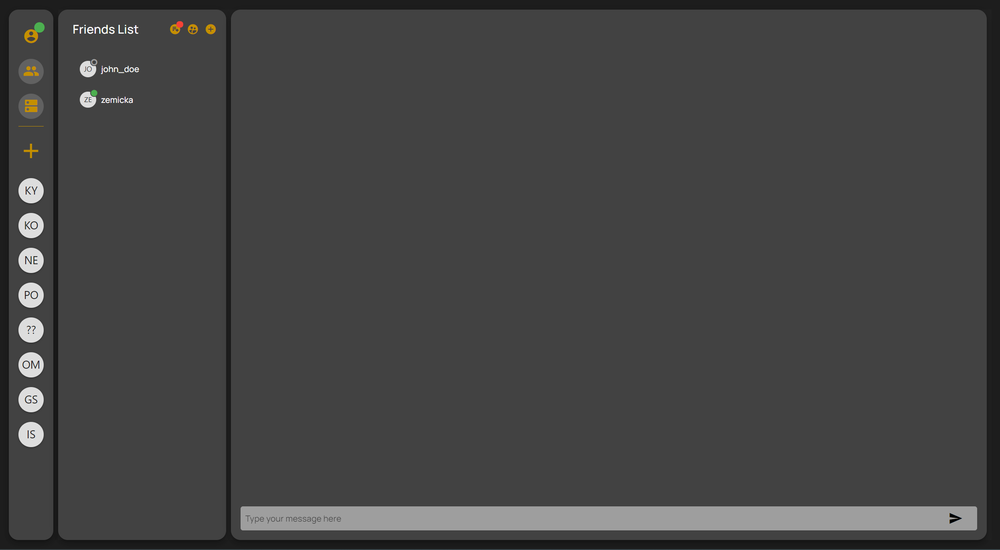
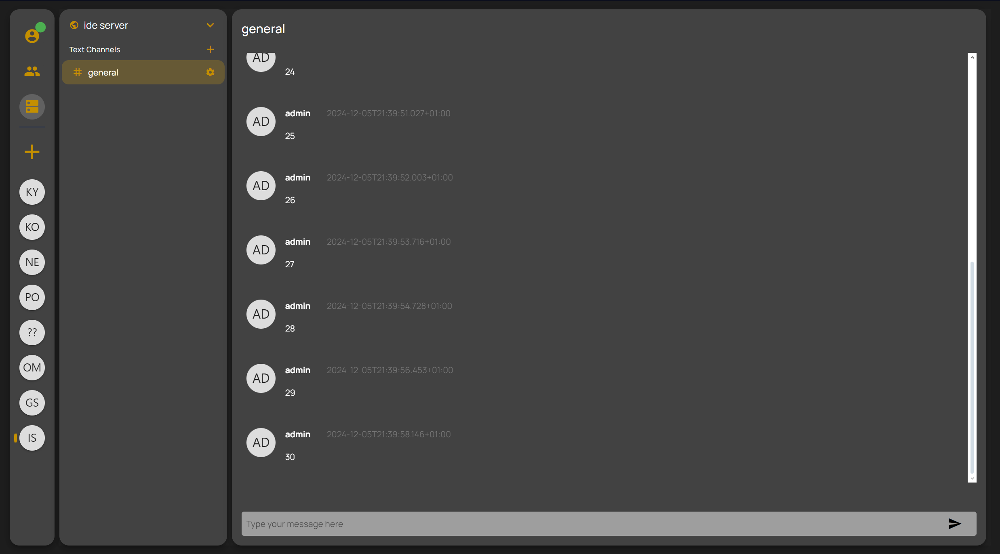
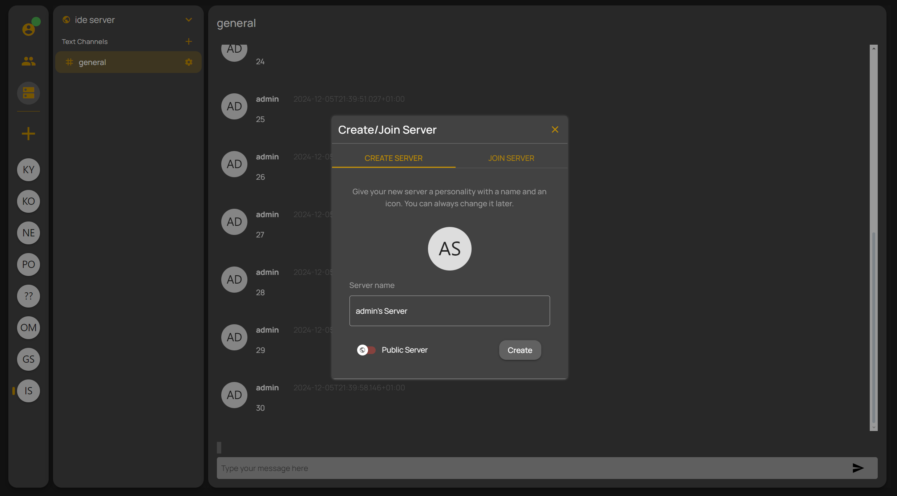
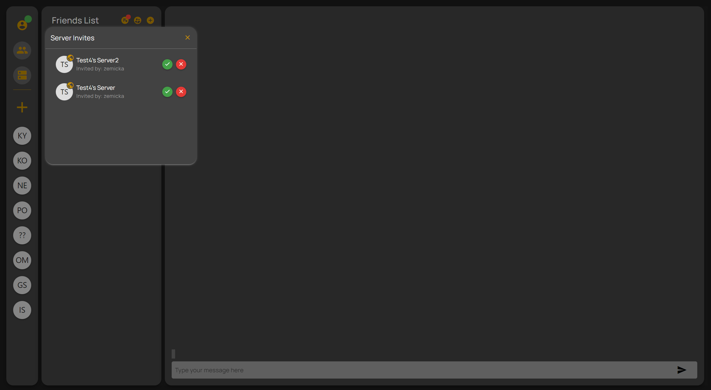

# VPWA Projekt - Dokumentácia
Autori: **V. Bejtic & P. Boržík**

### Zadanie
Vytvorte progresívnu webovú aplikáciu na textovú komunikáciu v štýle IRC (Slack), ktorá komplexne rieši nižšie definované prípady použitia.

### Návrhové rozhodnutia
- Štruktúra komunikácie:
  - **Friends** (kamaráti)
    - DM (Direct Message)
  - **Servers** (servery)
    - Channels - jeden server má viacero komunikačných kanálov
 

- Zabezpečenie vymazania neaktívnych serverov
  - Využitie **cron job-u** - v rámci nášho systému sme implementovali SQL funkciu, ktorá sa v pravidelných intervaloch v rámci docker container-a, presnejšie našej databázy spúšťa za pomoci spomínaného cron jobu. Rozhodli sme sa tak z dôvodu, že sme chceli simulovať reálnejší prípad použitia, rovnako tak sme rovnaku funkcionalitu mohli pripraviť na serverovej časti aplikácie, avšak spúšťačom by nebola automatická pravidelná kontrola a spustenie funkcie, ale podmienené spustenie.

  

- **Topovanie serveru** pri pozvaní - v našej implementácií sme danú úlohu interpretovali taktiež praktickejšie, riešime žiadosti o priateľstvo a pozvanie na server pomocou vizualizovaného zoznamu pozvánok. V našom prípade pri každej novej žiadosti je daná žiadosť topovaná a zvýraznená pomocou "badge" pri ikonke pozvaní a žiadostí v sekcií priateľov. Používateľ sa môže rozhodnúť o prijatí.

### Fyzický model databázy
- Hlavné a výrazné zmeny sú pasívne aplikované do našej databázy v rámci softvérového riešenia, ktoré používame - migrácie, autorizačné token-y a samotný AdonisJS. Tie si vytvárajú samostatné tabuľky v rámci našej databázy.
- Genericky sme využili možnosť automatického doplnenia dodatočných časových informácií o zmenách či vytvorení pre jednoduchšie log-ovanie údajov pri debug-ovaní či iných problémoch.
- Pri používateľoch sme taktiež pridali boolean stĺpec, ktorý hovorí o stave používateľa a jeho preferenciách o získavaní notifikácií, kde pri pravdivej hodnote dostane všetky a v prípade nepravdivej hodnoty obdrží iba notifikácie s označením.
- Pri serveroch a channel-och sme pridali ďalší atribút s názvom "position", ktorý špecifikuje poradie pri zobrazení jednotlivých channel a serverov. Tento atribút používateľovi umožňuje voľne presúvať a zoraďovať pozíciu serverov a kanálov na serveri.

### Diagram architektúry aplikácie

### Sreenshot-y

